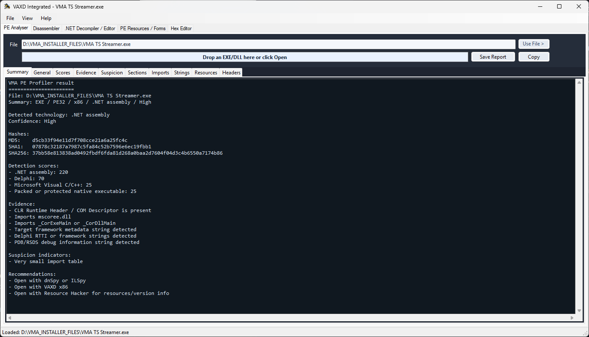
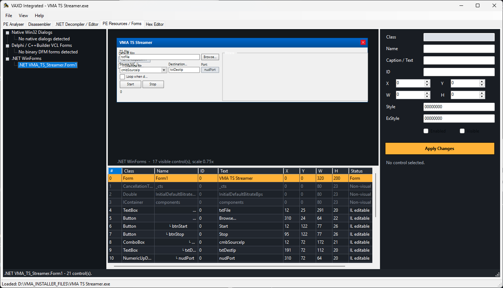
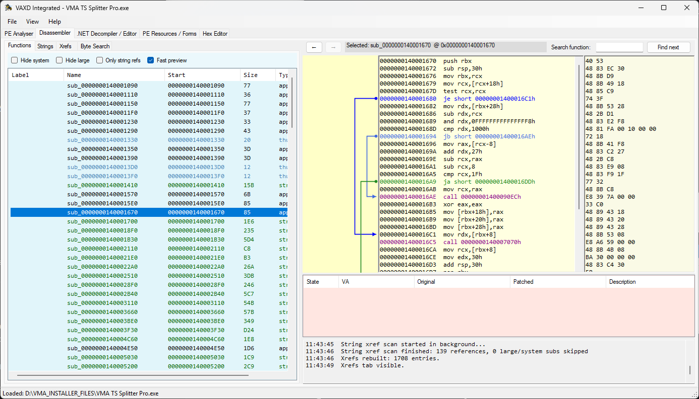
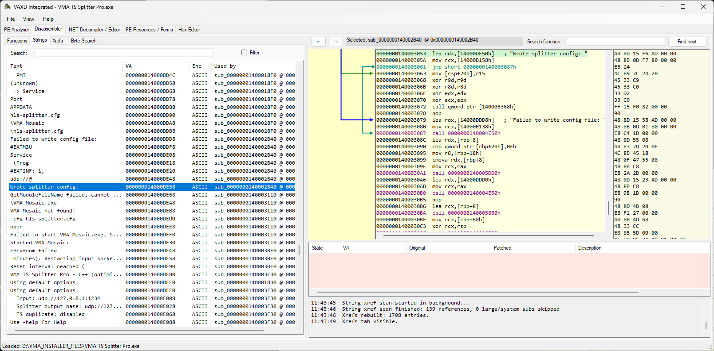
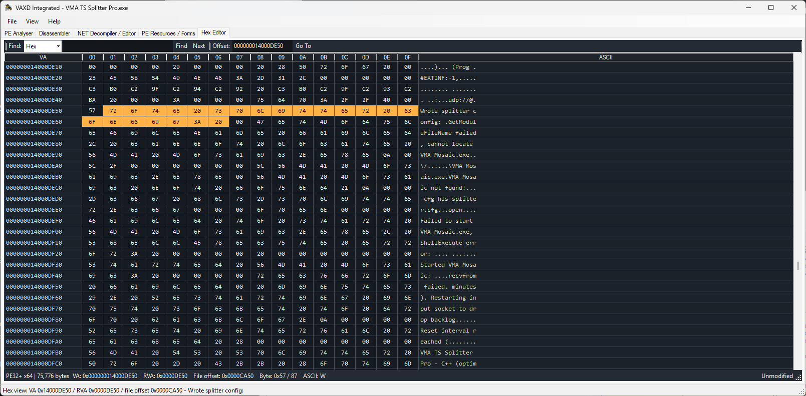

# VAXD

  

**VAXD** is a lightweight Windows disassembler, PE inspection tool, and patch-assistance environment for native Windows executable files.

It is designed for fast analysis of Windows PE EXE and DLL files, with a practical workflow focused on disassembly, navigation, strings, jumps, calls, patch planning, pseudo-code generation, and binary patching.

VAXD focuses on speed, simplicity, and usability. It is intended for users who want a quick and focused tool for inspecting native Windows executables without the complexity and overhead of larger reverse-engineering suites.

---

Home page: https://vma-broadcast.com/vaxd-vma-executable-disassembler/

This page is kept to maintain possible links in forums - please go to my homepage for updates and download.

---

## Screenshot

---
