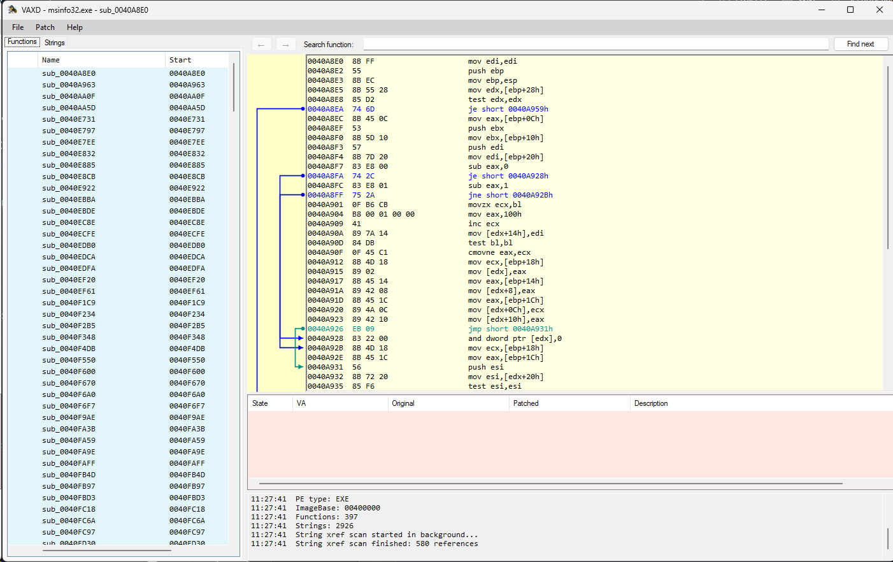

# VAXD

  

VAXD is a lightweight Windows disassembler and patch-assistance tool for PE executables and DLL files.

It includes separate versions for:

- x64 PE EXE/DLL files
- x86 PE EXE/DLL files

VAXD is designed for quick inspection, jump/call visualization, and simple binary patching workflows.

## Screenshot

## Features

- Open Windows PE EXE and DLL files
- x64 and x86 disassembly
- Function/subroutine listing
- DLL export detection
- Jump and call visualization
- Relative jump calculation
- Patch helper functions
- Lightweight interface compared with larger reverse-engineering suites

## Download

Download the latest ZIP package from the [Releases](https://github.com/bicurico/VAXD/releases/latest) section.

## License

The free version allows inspection and analysis.

Saving or exporting patched files requires a license.

For license requests, contact:

**vma@norcam.pt**

## Intended use

VAXD is intended for legitimate software analysis, education, interoperability research, malware triage, and inspection of software you own or are authorized to analyze.

## Third-party components

VAXD uses `Iced.dll`, based on the Iced disassembler library.

The required Iced MIT license text is included in the distributed `README.txt`.
